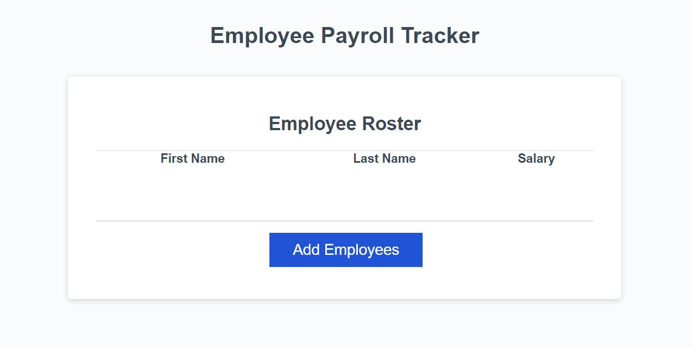

# Employee Payroll Tracker

## Description
An employee payroll tracker that enables payroll managers to view and manage employee payroll data. It's important keeping track of employee data. Since, it's the way a company's HR department can efficiently handle the human capital of the organization. By building this feature, I learned how important details are in the process of creating an application.

## Table of Contents
- [Installation](#installation)
- [Usage](#usage)
- [Credits](#credits)
- [License](#license)
- [How to Contribute](#how-to-contribute)
- [Tests](#tests)

## Installation
This project does not require an installation. However, you are welcome to to either clone the repository and access the project files or fork the repo.

## Usage
Deployed on [GitHub Pages](https://andresalbornozgil.github.io/employee-payroll-tracker/)

For the employee payroll tracker to work you must:

1. click the "Add employee" button, then you will be presented with a series of prompts asking for number of employees, first name, last name, and salary.
2. Add employee data (number of employees, name, last name, salary).
3. Employee/s will then be displayed on the page sorted alphabetically by last name, and the console will show computed and aggregated data.

## Credits
Andres Albornoz

## License
This project is unlicensed.

## How to Contribute
I am currently not looking for any contribution for this project as it's just a learning exercise.

## Tests
Tested at the time of deployment
